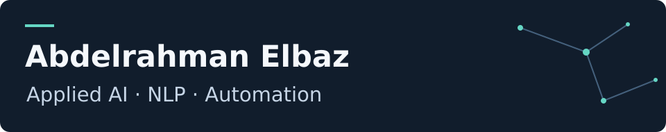

I have a Master of Engineering in applied AI and a background in mechatronics engineering . My interests span NLP, Explainable AI, and automation, with a focus on understanding how AI systems make decisions and building useful applications.

[LinkedIn](https://www.linkedin.com/in/a-elbaz/) · [Thesis](https://github.com/AbdulrahmanAlbaz/ai-text-detection-thesis)

## Research

**[Adversarial robustness in AI text detection](https://github.com/AbdulrahmanAlbaz/ai-text-detection-thesis)** — Master's thesis

I studied how adversarial text changes affect a RoBERTa-based detector on RAID, comparing hardening strategies through false-positive rates, false-negative rates, and attack-specific failures. The repository contains the report, results tables, and a visualization of the trade-offs.

## Projects

- **[AutoFlow](https://github.com/AbdulrahmanAlbaz/autoflow-ai-agent)** — A Python CLI for generating scripts from task descriptions and decomposing tasks into separate scripts.
- **[AI News Automation — بالعربي](https://github.com/AbdulrahmanAlbaz/ai-news-automation)** — An n8n workflow that scores AI-news RSS excerpts, prepares Egyptian Arabic post drafts, and saves selected drafts to Google Sheets.

## Education

- **M.Eng., Applied AI for Digital Production Management** — Deggendorf Institute of Technology, Germany, 2026.
- **B.Sc., Mechatronics Engineering** — Faculty of Engineering, Mansoura University, Egypt, 2018.

## Tools used in my work

**NLP & ML:** PyTorch · Hugging Face Transformers  
**Programming & workflows:** Python · n8n · OpenAI API · OpenRouter
